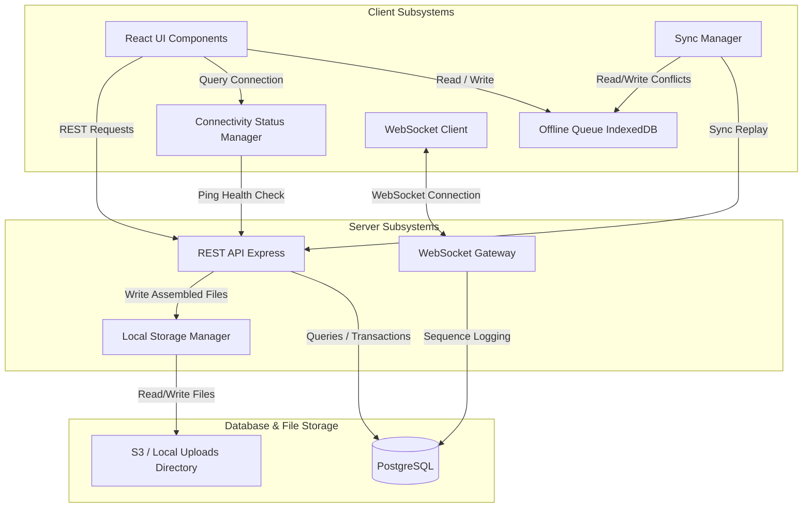
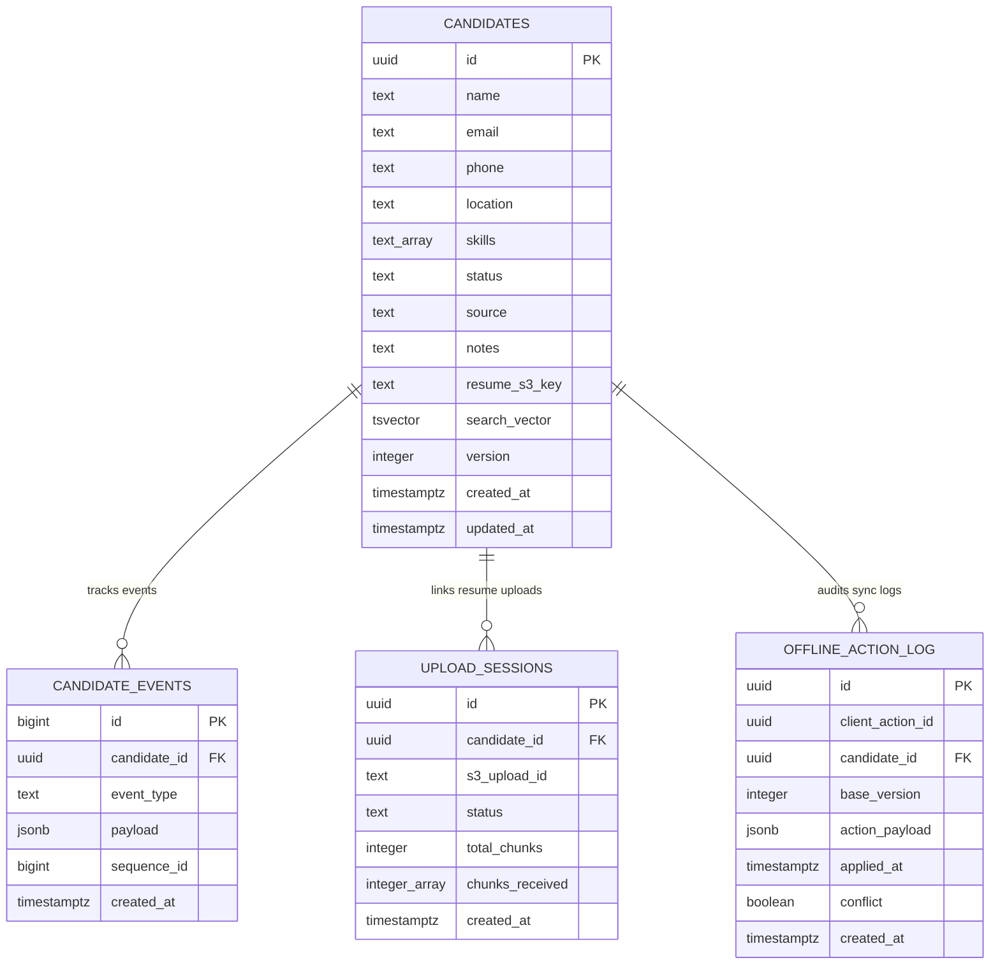
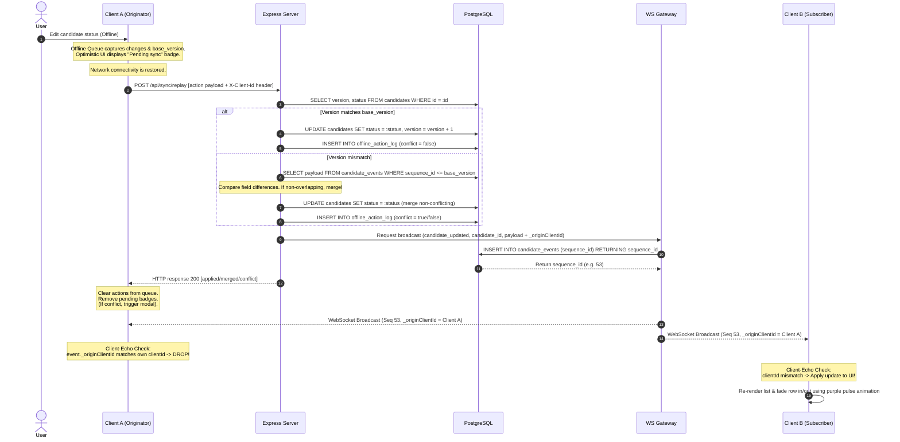

# System Architecture Document

This document provides a comprehensive overview of the Recruiter Workspace system architecture, including its components, database schema, and detailed data flow patterns.

---

## 1. Overall Component Map

The application is structured into a modern single-page frontend (React) and a resilient backend service (Express + WebSockets) connected to a PostgreSQL database.

### Component Details
* **React UI Components**: Render the list, modals, search inputs, and details views. Includes optimizations like memoized rows and stable selection callback handlers to handle large datasets (up to 100,000 candidates) smoothly.
* **Offline Queue (IndexedDB)**: Stores mutation actions (e.g., status updates) locally when the application is offline, along with the base version of the record when edited.
* **Connectivity Status Manager**: Monitors navigator status, sends periodic health check pings to `/health`, and blends WebSocket heartbeat status to deduce genuine network connectivity.
* **WebSocket Client**: A resilient class that establishes a persistent socket connection, handles automatic reconnects using exponential backoff, filters out echoing server-side updates, and queues incoming live messages to process them sequentially.
* **Sync Manager**: Loop-synchronizes queued actions back to `/api/sync/replay` when connectivity recovers. Manages merges, records server values in the local conflict store, and triggers the comparative resolution modals if overlapping modifications occur.
* **REST API**: Serves JSON endpoints for CRUD candidate listings, FTS prefix searches, Keyset pagination cursors, resumable chunked upload configurations, and sync-replay batch resolution.
* **WebSocket Gateway**: Handles auth identification, maps client connections by unique UUIDs, writes sequence numbers to the database for every action, and broadcasts updates to active clients.
* **Local Storage Manager**: Manages partial file streams, chunk aggregation, directory sanitation, and writes assembled files to disk (with support for S3 transitions).

---

## 2. Database Schema

The database runs on PostgreSQL. The tables are configured to support transactions, sequence tracking, and high-performance search indices.

### Table & Column Rationales

#### 1. `candidates`
Stores core profile information for applicants.
* `id` (UUID): Primary key, globally unique identifier.
* `name` / `email` / `phone`: Basic candidate contact details.
* `location`: Location string utilized in filters and paged cursors.
* `skills` (TEXT[]): Array of tags representing applicant skillsets. Supports Postgres `GIN` overlap queries.
* `status` (TEXT): Current recruitment status (e.g., *Applied*, *Interviewing*, *Rejected*).
* `notes` (TEXT): Recruiter notes text field.
* `resume_s3_key` (TEXT): Path or S3 key linking the candidate to their uploaded resume file.
* `search_vector` (TSVECTOR): Autogenerated full-text search token representation.
* `version` (INTEGER): Optimistic concurrency token. Incremented on every update; used by the sync replay engine to identify conflicts.

#### 2. `candidate_events`
Stores audit events and serves as the source of truth for real-time WebSocket catch-up.
* `id` / `sequence_id` (BIGINT): Sequentially increasing sequence identifiers. Clients request missed events using `since/:sequenceId` queries.
* `candidate_id` (UUID): References the affected candidate record.
* `event_type` (TEXT): Type of event (e.g., `candidate_created`, `candidate_updated`, `candidate_resume_uploaded`).
* `payload` (JSONB): Dynamic event payload. Contains the updated candidate columns and `_originClientId`.

#### 3. `upload_sessions`
Tracks in-progress and completed chunked file uploads.
* `id` (UUID): Unique session ID.
* `s3_upload_id` (TEXT): The filename (or S3 multipart ID) for the file being uploaded.
* `status` (TEXT): State of upload session (`in_progress` or `completed`).
* `total_chunks` (INTEGER): Total count of chunks in which the file is split.
* `chunks_received` (INTEGER[]): Array of successfully written chunk indices, enabling resume operations to identify missing chunks.

#### 4. `offline_action_log`
Audit history recording offline client synchronization outcomes.
* `client_action_id` (UUID): The client-generated identifier for the action, preventing double replay.
* `base_version` (INTEGER): The candidate version expected by the client when they performed the action offline.
* `conflict` (BOOLEAN): Flag indicating if the change triggered a conflict resolved by the client resolution modal.

---

## 3. Data Flow: Candidate Update

This diagram traces a candidate update action from the moment a user performs it on a client through database commits, WebSocket broadcasting, client filtering, and live UI highlights.

### Steps in the Update Flow
1. **User Action**: The user edits candidate information. If the client is offline, the status is optimistically updated in the local UI, displaying a "Pending sync" badge, and the mutation details (including the current `base_version` of the candidate) are enqueued in IndexedDB.
2. **Replay Submission**: Once connectivity is restored, the `Sync Manager` triggers and posts all pending actions to `/api/sync/replay` along with an `X-Client-Id` header identifying the originating client.
3. **Database Read**: The server checks the database candidate version. If it matches, the edit is applied directly. If not, it executes conflict detection checking if the changes overlap with modifications made since the base version.
4. **Database Commit**: Non-conflicting fields are merged and committed. An offline action log row is inserted.
5. **Broadcast Request**: The route handler triggers the `broadcast` function, appending the client originator's ID as `_originClientId` in the payload.
6. **Sequence Generation**: The event is written to `candidate_events`, generating a sequential, database-backed `sequence_id` used for tracking.
7. **Replay HTTP Response**: The server sends the replay results back to the client, allowing Client A to immediately remove synced entries from the local queue.
8. **WebSocket Broadcast**: The WebSocket Gateway iterates through all connected sockets and pushes the event.
9. **Origin Client filtering**: Client A receives its own echoed event. It recognizes `_originClientId` matches its own client ID, and drops the event, preventing double-apply and list flicker.
10. **Subscriber Client UI Update**: Client B receives the event, maps it to the candidate list state, and triggers a 2-second CSS purple highlight pulse on the modified row.
