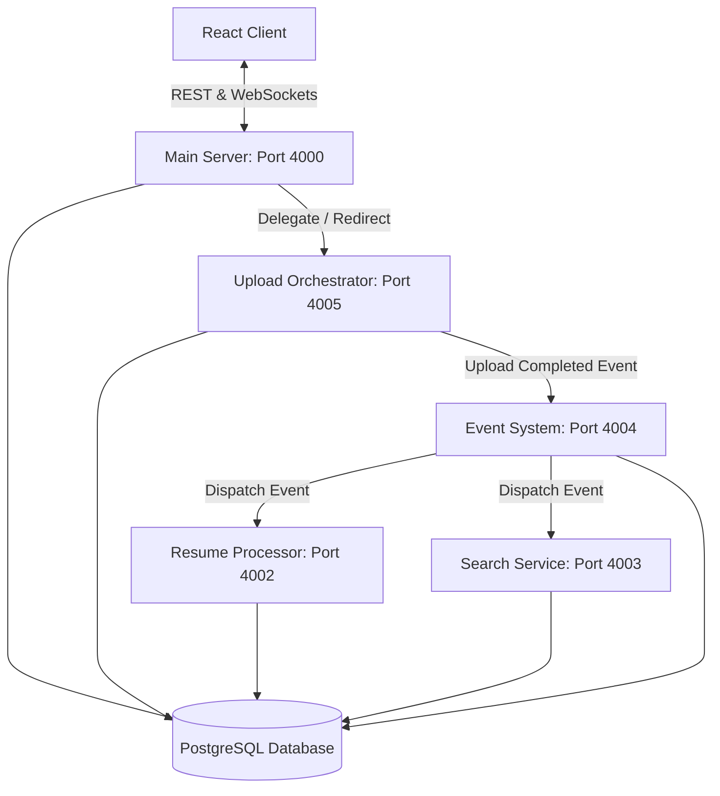

# Recruiter Workspace - Data & Event Pipeline

This directory contains the microservices that make up the asynchronous data and event processing pipeline for the Recruiter Workspace platform.

Each service is decoupled, runs independently on its own port, and uses **Pino** for structured JSON logging to facilitate centralized log parsing.

---

## Architecture & Service Map



---

## Services Overview

### 1. Upload Orchestrator (`rw-upload-orchestrator`)
* **Default Port:** `4005`
* **Role:** Manages the lifecycle of chunked, resumable, and multipart file uploads (e.g., candidate resumes). It tracks active upload sessions in the database, validates incoming chunks, compiles files, and publishes completion notifications to the event system.

### 2. Processor (`rw-processor`)
* **Default Port:** `4002`
* **Role:** An asynchronous background worker service. When notified of new uploads, it processes files (e.g., extracting metadata and text from resumes, parsing contact information, categorizing skills) and updates candidate records.

### 3. Search Service (`rw-search-service`)
* **Default Port:** `4003`
* **Role:** Manages full-text search indices. It listens for changes to candidate profiles or resumes to update indices, and serves high-performance search queries independently of the primary Express server's query load.

### 4. Event System (`rw-event-system`)
* **Default Port:** `4004`
* **Role:** The communication backbone of the pipeline. It handles event routing, pub/sub mechanics, and sequence tracking for events within the workspace, dispatching tasks to downstream consumers (like the Processor and Search Service).

---

## Cross-Cutting Features

1. **Structured Logging (`pino`):**
   Machine-parseable JSON log format is mandatory across all services to support robust trace analytics, monitoring, and auditability.
   
2. **Environment Configuration:**
   Each service is configured via a local `.env` file (copied from `.env.example`).
   
3. **Database Integration (`pg`):**
   Services share database access (via PostgreSQL `DATABASE_URL`) to read and commit updates within their respective bounds.

---

## Getting Started

To run any service locally:
1. Navigate to the service folder:
   ```bash
   cd pipeline/<service-name>
   ```
2. Copy the `.env.example` to `.env` and fill in configuration variables:
   ```bash
   cp .env.example .env
   ```
3. Install dependencies:
   ```bash
   npm install
   ```
4. Start in development mode (using watch mode):
   ```bash
   npm run dev
   ```
